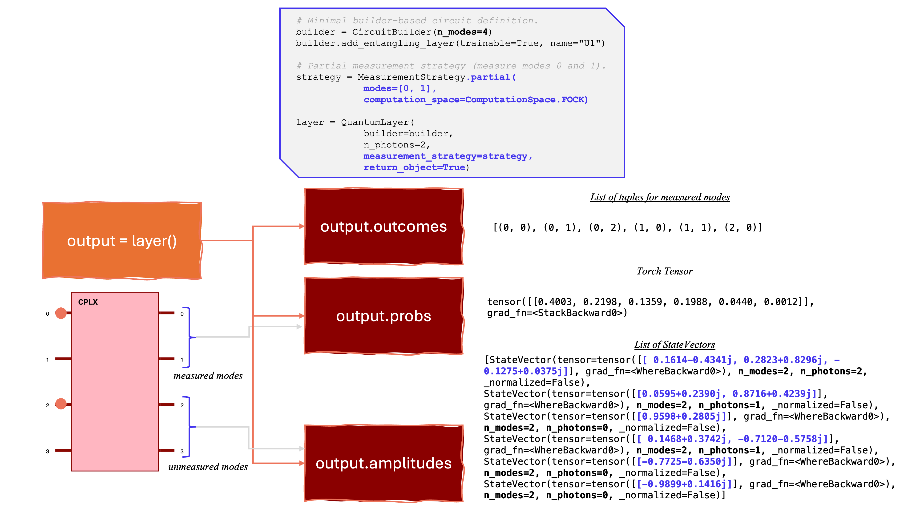

Partial Measurement
===================

Partial measurement lets you **measure only a subset of modes** and keep the
remaining modes as quantum state vectors. This is useful when you want classical
probabilities for some modes while preserving quantum information in the rest.

In practice you get two things:

1. A probability distribution over the measured-mode outcomes.
2. A list of conditional state vectors for the unmeasured modes, one per outcome.

Minimal example
---------------

Below is an example based on a 4-mode circuit. We measure modes ``[0, 1]``
out of 4 total modes with 2 photons in the Fock basis.

.. code-block:: python

   from merlin import CircuitBuilder, QuantumLayer
   from merlin.core.computation_space import ComputationSpace
   from merlin.measurement.strategies import MeasurementStrategy

   # Minimal builder-based circuit definition.
   builder = CircuitBuilder(n_modes=4)
   builder.add_entangling_layer(trainable=True, name="U1")

   # Partial measurement strategy (measure modes 0 and 1).
   strategy = MeasurementStrategy.partial(
       modes=[0, 1],
       computation_space=ComputationSpace.FOCK,
   )

   layer = QuantumLayer(
       builder=builder,
       n_photons=2,
       measurement_strategy=strategy,
       return_object=True,
   )

   output = layer()

   print(layer)
   print(f" - Output type: {type(output)}")
   print("--------- AMPLITUDES (unmeasured modes) ---------")
   print(f" - Amplitudes = {output.amplitudes}")
   print(f"\n - Amplitudes to tensor = {[amp.tensor for amp in output.amplitudes]}")
   print(f"\n - Measured modes = {output.measured_modes}")
   print(f"\n --------- PROBABILITIES (measured modes) ---------")
   print(f"\n - Probabilities (tensor shape) = {output.probabilities}")
   print(f"\n - Amplitudes length {len(output.amplitudes)} and probabilities {output.probabilities.shape}")

What you get (and what it means)
--------------------------------

``output`` is a ``PartialMeasurement`` object. The key fields are:

1. ``output.measured_modes``: the indices you measured (``(0, 1)`` here).
2. ``output.outcomes``: a list of tuples indicating the measured Fock outcomes 
   for the measured modes.
3. ``output.probabilities``: a tensor with the probability of each measured-mode
   outcome. Each column corresponds to one measured Fock outcome.
4. ``output.amplitudes``: a list of ``StateVector`` objects for the **unmeasured
   modes only**. The list is aligned with ``output.probabilities``: each element
   is the conditional state given the corresponding measured outcome.

In other words, partial measurement returns a **classical distribution for the
measured modes** and a **quantum state for the unmeasured modes**, with one
conditional state per outcome.

About ``grouping`` in partial measurement
-----------------------------------------

If you pass a ``grouping`` object to ``MeasurementStrategy.partial(...)``, it
**only groups the probabilities**, not the amplitudes. Concretely:

1. ``output.probabilities`` (or ``output.tensor``) is grouped according to the
   grouping rule, so its second dimension becomes the grouping output size. This does
   not change the .outcomes themselves.
2. ``output.amplitudes`` stays **one conditional state per measured outcome**.
   The amplitudes list is not grouped or merged.

This means grouping is a *probability-only* post-processing step. It changes
the reported distribution of measured outcomes, while leaving the conditional
state vectors for the unmeasured modes intact.
