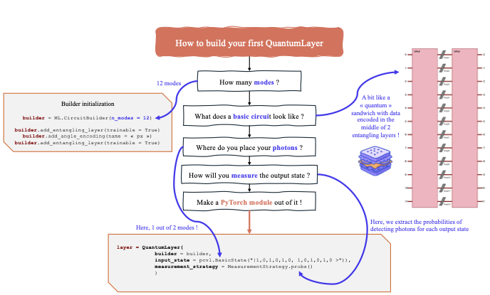

:github_url: https://github.com/merlinquantum/merlin

===============
Basic Concepts
===============

This guide introduces the fundamental concepts behind Merlin's approach to quantum neural networks.

Merlin centres on three high-level tools you will see throughout the quickstart:

- **Photonic simulation** with fast classical solvers so you can prototype locally before targeting hardware.
- **CircuitBuilder** for declaratively authoring interferometers, encoding steps, and trainable components.
- **QuantumLayer** for dropping your circuit into any PyTorch model with automatic differentiation support.

Conceptual Overview
===================

Merlin bridges the gap between physical quantum circuits and high-level machine learning interfaces through a layered architecture. From lowest to highest level:

1. **Physical Quantum Circuits**: The actual photonic hardware (or fast simulation thereof)
2. **Photonic Backend**: Mathematical models of quantum circuits with configurable components
3. **CircuitBuilder** (:class:`~merlin.builder.circuit_builder.CircuitBuilder`): Declarative interface for assembling photonic circuits
4. **Encoding**: Strategies for mapping classical features to quantum parameters
5. **Measurement Strategy**: Strategies for converting quantum outputs to classical outputs
6. **QuantumLayer**: High-level PyTorch interface that combines all these concepts

Let's explore each level in detail.

1. Physical Foundation: Photonic Circuits
=========================================

At the foundation, Merlin uses **photonic quantum computing**, where information is encoded in photons (particles of light) traveling through optical circuits. These circuits consist of:

- **Modes**: Independent optical pathways (like waveguides) that can carry photons
- **Photons**: Quantum information carriers; more photons enable more complex quantum interference
- **Optical Components**: Beam splitters, phase shifters, and interferometers that manipulate photon paths

.. image:: ../_static/img/Interferometer_training.png
   :alt: 12-mode interferometer with 6 photons

On the image above, you can see a 12-mode interferometer with 6 photons entering. The photons interfere as they pass through the optical components, creating complex quantum states. We measure the output distribution of photons across the modes to extract information.
Here, we could write

.. code-block:: python
    # A simple photonic system
    n_modes = 12        # 4 optical pathways
    n_photons = 6     # 2 photons for quantum interference
    input_state = pcvl.BasicState("|1, 0, 1, 0, 1, 0, 1, 0, 1, 0, 1, 0>")  # Alternating photon pattern

For a deeper understanding of photonic quantum computing fundamentals, see :doc:`../quantum_expert_area/architectures`.

First, we present the overview of the building of a QuantumLayer, brick by brick using the `CircuitBuilder`.

Overview of the Merlin hybrid workflow.

2. Backend : Mathematical Models
========================================

To run this `layer`, the **Backend** provides mathematical representations of quantum circuits, handling the complex quantum mechanics while exposing a clean interface for machine learning.

Key responsibilities:

- **State Evolution**: Computing how quantum states change through the circuit (see :doc:`../quantum_expert_area/SLOS`)
- **Simulation Modes**: Switching between sampling and deterministic simulation for rapid prototyping
- **Parameter Management**: Tracking which components are configurable vs. fixed
- **Measurement Simulation**: Converting quantum states to probability distributions

Merlin comes with high-performance classical simulators (SLOS and Clifford-based modes) so you can prototype and train without immediate access to hardware. Switching to hardware later only requires changing the backend configuration.

3. Encoding: Classical-to-Quantum Mapping
=========================================

**Encoding** defines how classical input features are mapped to quantum circuit parameters. This is crucial because quantum circuits operate on phases and amplitudes, not raw feature values.

**Key Steps**:

1. **Normalization**: Ensure inputs are in :math:`[0,1]` range
2. **Scaling**: Apply scaling for quantum parameter ranges
3. **Circuit Mapping**: Distribute to quantum parameters based on the configured circuit

Angle Encoding
^^^^^^^^^^^^^^

**Angle encoding** rotates programmable elements of the circuit by an angle proportional to each classical feature.

.. code-block:: python

    import merlin as ML
    import numpy as np

    builder = ML.CircuitBuilder(n_modes=4)
    builder.add_angle_encoding(scale=np.pi)    # Rotations proportional to input features

Angle encoding keeps circuit depth compact while still giving continuous control over the interferometer. Keep signals normalized (or pass them through a bounded activation such as ``torch.tanh``) so the mapped rotation angles remain in a sensible range.

Amplitude Encoding
^^^^^^^^^^^^^^^^^^

**Amplitude encoding** maps classical data directly into the amplitudes of a quantum
state. Rather than turning features into phase-shifter angles, you represent your data
*as the quantum state itself* and the circuit acts as a learned unitary transformation
on it. The feature vector length must match the Fock basis size
:math:`d = \binom{n\_modes + n\_photons - 1}{n\_photons}`.

Wrap your real-valued data with
:meth:`StateVector.from_tensor() <merlin.core.state_vector.StateVector.from_tensor>`
and pass the result to ``forward()`` — the layer detects the type and activates
amplitude encoding automatically:

.. code-block:: python

    import torch
    from merlin.core.state_vector import StateVector

    features = torch.randn(8, 10)          # batch of 8, d = 10 (4 modes, 2 photons)
    sv = StateVector.from_tensor(features, n_modes=4, n_photons=2)
    output = layer(sv)                     # shape: (8, output_size)

For a detailed comparison of angle vs. amplitude encoding and complete runnable examples,
see :doc:`../user_guide/angle_amplitude_encoding`.

Initial State Patterns
^^^^^^^^^^^^^^^^^^^^^^

The initial distribution of photons affects quantum behavior:

.. code-block:: python

    # Example state patterns
    ML.StatePattern.PERIODIC     # [1,0,1,0] - alternating photons
    ML.StatePattern.SPACED       # [1,0,0,1] - evenly spaced
    ML.StatePattern.SEQUENTIAL   # [1,1,0,0] - consecutive

Different patterns create different types of quantum interference and correlations.

For detailed encoding strategies and optimization techniques, see :doc:`../user_guide/angle_amplitude_encoding`.

4. Measurement Strategy: Quantum-to-Classical Conversion
==================================================

**Measurement Strategy** converts quantum measurement results (probability distributions or amplitudes) into classical outputs.

Quantum circuits produce probability distributions or amplitudes (in simulation) over possible photon configurations. Measurement strategy determines which formatting to use.

.. code-block:: python

    # Common measurement strategies
    ML.MeasurementStrategy.probs()              # Default: full probability distribution
    ML.MeasurementStrategy.mode_expectations()  # Per-mode photon statistics
    ML.MeasurementStrategy.amplitudes()         # Complex amplitudes (simulation only)

To reduce the dimensionality of the Fock distribution after measurement, compose your layer with a grouping
:class:`~merlin.utils.grouping.LexGrouping` or :class:`~merlin.utils.grouping.ModGrouping`.

**Key Concept**: Measurement strategy bridges the gap between quantum measurements and classical outputs. The choice affects both the interpretability and expressivity of your quantum layer.

For detailed comparisons and selection guidelines, see :doc:`../user_guide/measurement_strategy` and :doc:`../user_guide/grouping`.

Grouping strategies
-------------------

Two simple, built-in grouping strategies are provided to reduce the high-dimensional
Fock outputs to a smaller set of classical features:

- ``LexGrouping``: assigns consecutive output indices to the same bucket (lexicographic
    ordering). This preserves locality in the Fock index ordering and is a good default
    when nearby basis states are expected to encode related features.
- ``ModGrouping``: maps output indices to buckets using a modulo operation, effectively
    interleaving states across groups. This is useful when you want to mix information
    from distant basis states or avoid clustering correlated states into the same bucket.

Example::

        # Collapse the Fock output into 3 features by grouping consecutive indices
        grouped_layer = ML.LexGrouping(quantum_layer.output_size, 3)

        # Alternatively, interleave states into 3 groups
        interleaved = ML.ModGrouping(quantum_layer.output_size, 3)

5. High-Level Interface: QuantumLayer
=====================================

The **QuantumLayer** combines all these concepts into a PyTorch-compatible interface that plays nicely with standard deep learning tooling. Build a circuit with the builder interface, then pass it to the layer alongside the parameters you want Merlin to manage:

.. code-block:: python

    import merlin as ML
    import numpy as np
    from merlin.core.state_vector import StateVector

    builder = ML.CircuitBuilder(n_modes=6)
    builder.add_angle_encoding(name="px", modes=[0, 1, 2, 3], scale=np.pi)
    builder.add_entangling_layer(trainable=True)

    quantum_layer = ML.QuantumLayer(
        input_size=4,                                   # Classical feature dimension
        builder=builder,                                # CircuitBuilder instance
        n_photons=2,                                    # Number of photons in the register
        input_state=StateVector.from_basic_state([1, 0, 0, 1, 0, 0]),  # Initial photon pattern
        measurement_strategy=ML.MeasurementStrategy.probs(ML.ComputationSpace.FOCK),
        return_object=False                             # Choose whether or not to return a typed object after a forward call 
                                                        # depending on the measurement strategy. Default is False.
    )

    # Optional: down-sample the Fock distribution to 3 features using a Linear Layer
    mapped_layer = nn.Sequential(
        quantum_layer,
        nn.Linear(quantum_layer.output_size, 3),
    )

Key parameters to tune when instantiating :class:`~merlin.algorithms.layer.QuantumLayer`:

- ``builder`` or ``circuit``: define the photonic circuit you want to simulate.
- ``n_photons`` and ``input_state``: set the quantum resources entering the interferometer. The preferred type for ``input_state`` is :class:`~merlin.core.state_vector.StateVector`, which bundles amplitudes with Fock metadata and supports superposition inputs that plain lists cannot express. Lists, ``pcvl.BasicState``, and ``pcvl.StateVector`` are also accepted.
- ``input_parameters``: prefixes generated by :meth:`~merlin.builder.circuit_builder.CircuitBuilder.add_angle_encoding`.  Derived automatically when a ``builder`` is provided; only needed with a bare ``circuit``.
- ``measurement_strategy``: pick the classical readout and computation space via the factory methods ``.probs()``, ``.mode_expectations()``, ``.amplitudes()``, or ``.partial()``.  The ``ComputationSpace`` is passed as a parameter to the factory (e.g. ``MeasurementStrategy.probs(ComputationSpace.FOCK)``).
- ``return_object``: Choose to return a typed object as the forward output depending  on the ``measurement_strategy``.  The default value is False. Take a look at :doc:`../api_reference/api/merlin.algorithms.layer` for more details about the return types.

Encoding mode is inferred from the input type
----------------------------------------------

The layer decides between angle and amplitude encoding based on what you pass to
``forward()``:

- **Real** ``torch.Tensor`` → angle encoding (features mapped to phase shifters).
- :class:`~merlin.core.state_vector.StateVector` → amplitude encoding (use :meth:`~StateVector.from_tensor` for classical data).
- **Complex** ``torch.Tensor`` → amplitude encoding (tensor variant).

No special constructor flags are needed — just pass the right type.

Typed outputs with ``return_object=True``
-----------------------------------------

By default, the output of the QuantumLayer's forward function is a ``torch.Tensor``. However if the parameter ``return_object`` is set to True in the initialization
(it is False by default), the layer returns typed Merlin objects instead of bare tensors, carrying metadata such as mode count, photon number, and computation space:

- ``.probs()`` → :class:`~merlin.core.probability_distribution.ProbabilityDistribution`, an object that regroups all of the possible outcomes and their probabilities.
For more details, :doc:`/api_reference/api/merlin.algorithms.core.probability_distribution`.
- ``.amplitudes()`` → :class:`~merlin.core.state_vector.StateVector`, an object that regroups all of the possible state_vectors at the end of the circuit and their basis state decomposition.
For more details, :doc:`/api_reference/api/merlin.algorithms.core.state_vector`.
- ``.mode_expectations()`` → ``torch.Tensor``

Even when ``return_object=False``,
- ``.partial()`` → :class:`~merlin.core.partial_measurement.PartialMeasurement`, an object that regroups all of the measurement results and possible output ``StateVectors``.
For more details, :doc:`/api_reference/api/merlin.algorithms.core.partial_measurement`.

Putting It All Together
=======================

Here's how all these concepts work together in practice:

.. code-block:: python

    import torch
    import torch.nn as nn
    import merlin as ML
    import numpy as np
    from merlin.core.state_vector import StateVector

    class HybridModel(nn.Module):
        def __init__(self):
            super().__init__()

            # Classical preprocessing
            self.classical_input = nn.Linear(8, 4, bias=False)

            # Quantum processing layer
            builder = ML.CircuitBuilder(n_modes=6)
            builder.add_angle_encoding(name="px", modes=[0, 1, 2, 3], scale=np.pi)
            builder.add_entangling_layer(trainable=True)
            builder.add_superpositions(trainable=True)

            quantum_core = ML.QuantumLayer(
                input_size=4,
                builder=builder,
                n_photons=2,
                input_state=StateVector.from_basic_state([1, 0, 0, 1, 0, 0]),
                measurement_strategy=ML.MeasurementStrategy.probs(ML.ComputationSpace.FOCK),
            )
            self.quantum = nn.Sequential(
                quantum_core,
                # Lexicographic grouping: collapse the high-dimensional Fock output into `6` buckets
                # by assigning consecutive output indices to the same group. This preserves local
                # structure in the Fock ordering and is useful when nearby basis states encode
                # similar features.
                ML.LexGrouping(quantum_core.output_size, 6),
            )

            # Classical output
            self.classifier = nn.Linear(6, 3)

        def forward(self, x):
            x = self.classical_input(x)
            x = torch.sigmoid(x)           # Normalize for quantum encoding
            x = self.quantum(x)            # Quantum transformation
            return self.classifier(x)

    # The quantum stack automatically handles:
    # - Photonic backend simulation
    # - Classical-to-quantum encoding
    # - Quantum computation
    # - Quantum-to-classical measurement (plus optional grouping)

Design Guidelines
=================

When choosing configurations, consider these general principles:

**Start Simple**: Begin with a small ``CircuitBuilder`` (4–6 modes), default ``.probs()`` measurement, and a lightweight classical head.

**Match Complexity to Problem**:

- Simple problems → few modes, shallow entangling layers
- Complex problems → more modes, combine entangling layers with superpositions

**Computational Constraints**:

- Limited resources → fewer photons, prefer ``ComputationSpace.UNBUNCHED`` when your circuit avoids photon bunching
- More resources available → increase photon count or depth for richer expressivity

**Experiment Systematically**: The quantum advantage often comes from the right combination of circuit design, encoding, measurement strategy, and optional grouping for your specific problem.

For detailed optimization strategies and advanced configurations, see the :doc:`../user_guide/index` section.

Next Steps
==========

Now that you understand the conceptual hierarchy:

1. **Start Simple**: Prototype with ``CircuitBuilder`` defaults and the built-in simulator
2. **Experiment**: Try different CircuitBuilder layouts, measurement strategies, and grouping modules for your use case
3. **Optimize**: Tune circuit size and encoding strategies based on performance
4. **Advanced Usage**: Explore custom circuit definitions when needed

For practical implementation, continue to :doc:`first_quantum_layer` to see these concepts in action.