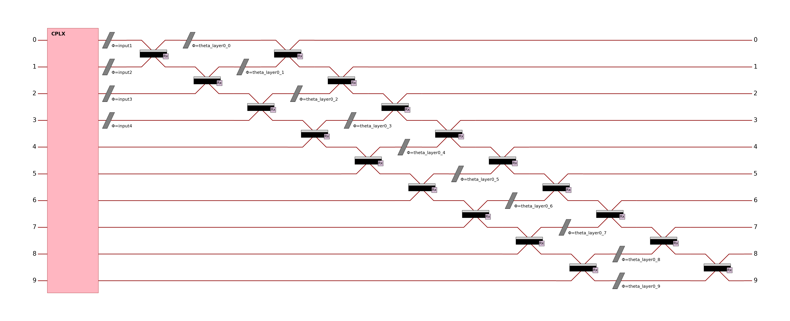
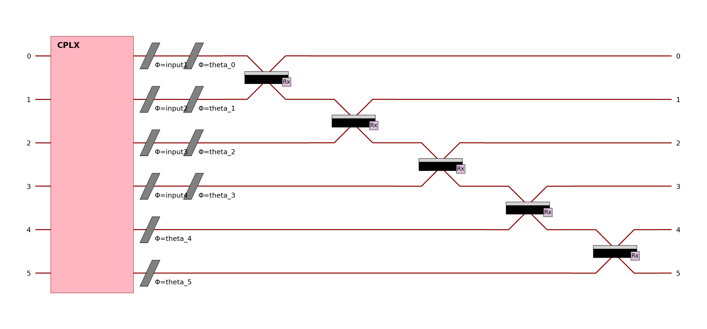
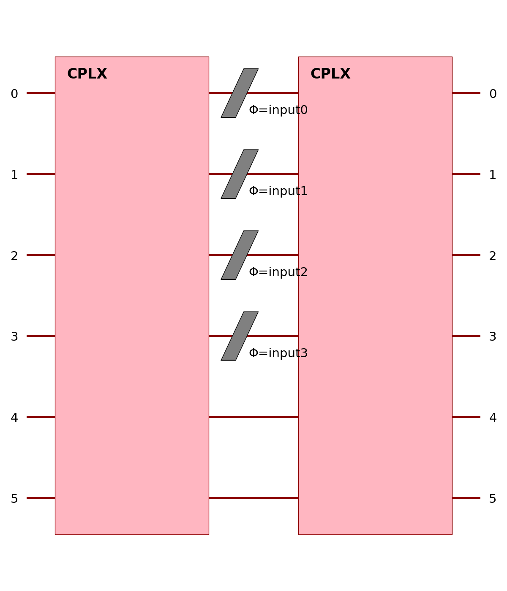

merlin.algorithms.layer module
==============================

.. automodule:: merlin.algorithms.layer
   :members:
   :undoc-members:
   :show-inheritance:

Example: Quickstart QuantumLayer
--------------------------------

.. code-block:: python

    from merlin import QuantumLayer, OutputMappingStrategy
    simple_layer = QuantumLayer.simple(
        input_size=4,
        n_params=120,
        output_size=3,
        output_mapping_strategy=OutputMappingStrategy.GROUPING,
    )
    # Train and evaluate as a standard torch.nn.Module

The simple quantum layer above implements a circuit of 10 modes and 5 photons with at least 90 trainable parameters. This circuit is made of:
- A first entangling layer (trainable)
- Angle encoding on the first N modes (for N input parameters with `input_size <= n_modes`)
- Add rotations to match the correct number of trainable parameters

Example: Declarative builder API
--------------------------------

.. code-block:: python

    from merlin.builder import CircuitBuilder
    builder = CircuitBuilder(n_modes=6)
    builder.add_entangling_layer(trainable=True, name="U1")
    builder.add_angle_encoding(modes=list(range(4)), name="input")
    builder.add_rotations(trainable=True, name="theta")
    builder.add_superpositions(depth=1)

    builder_layer = QuantumLayer(
        input_size=4,
        circuit=builder,
        n_photons=3, # is equivalent to input_state=[1,1,1,0,0,0]
        output_size=3,
        output_mapping_strategy=OutputMappingStrategy.GROUPING,
    )
    # Train and evaluate as a standard torch.nn.Module

The circuit builder allows you to build your circuit layer by layer, with a high-level API. The example above implements a circuit of 6 modes and 3 photons.
This circuit is made of:
- A first entangling layer (trainable)
- Angle encoding on the first 4 modes (for 4 input parameters with the name "input")
- A trainable rotation layer to add more trainable parameters
- An entangling layer to add more expressivity

Other building blocks in the CircuitBuilder include:

- **add_rotations**: Add single or multiple phase shifters (rotations) to specific modes. Rotations can be fixed, trainable, or data-driven (input-encoded).
- **add_angle_encoding**: Encode classical data as quantum rotation angles, supporting higher-order feature combinations for expressive input encoding.
- **add_entangling_layer**: Insert a multi-mode entangling layer (implemented via a generic interferometer), optionally trainable, and tune its internal template with the ``model`` argument (``"mzi"`` or ``"bell"``) for different mixing behaviours.
- **add_superpositions**: Add one or more beam splitters (superposition layers) with configurable targets, depth, and trainability.
- **begin_section / end_section / add_adjoint_section**: Define modular circuit sections, optionally with adjoint (inverse) structure and parameter sharing for advanced workflows.

Example: Manual Perceval circuit (more control)
-----------------------------------------------

.. code-block:: python

    import perceval as pcvl
    modes = 6
    wl = pcvl.GenericInterferometer(
        modes,
        lambda i: pcvl.BS() // pcvl.PS(pcvl.P(f"theta_li{i}")) //
        pcvl.BS() // pcvl.PS(pcvl.P(f"theta_lo{i}")),
        shape=pcvl.InterferometerShape.RECTANGLE,
    )
    circuit = pcvl.Circuit(modes)
    circuit.add(0, wl)
    for mode in range(4):
        circuit.add(mode, pcvl.PS(pcvl.P(f"input{mode}")))
    wr = pcvl.GenericInterferometer(
        modes,
        lambda i: pcvl.BS() // pcvl.PS(pcvl.P(f"theta_ri{i}")) //
        pcvl.BS() // pcvl.PS(pcvl.P(f"theta_ro{i}")),
        shape=pcvl.InterferometerShape.RECTANGLE,
    )
    circuit.add(0, wr)

    manual_layer = QuantumLayer(
        input_size=4, # matches the number of phase shifters named "input{mode}"
        circuit=circuit,
        input_state=[1,0,1,0,1,0],
        trainable_parameters=["theta"],
        input_parameters=["input"],
        output_size=3,
        output_mapping_strategy=OutputMappingStrategy.GROUPING,
    )
    # Train and evaluate as a standard torch.nn.Module

See the User guide and Notebooks for more advanced usage and training routines !
