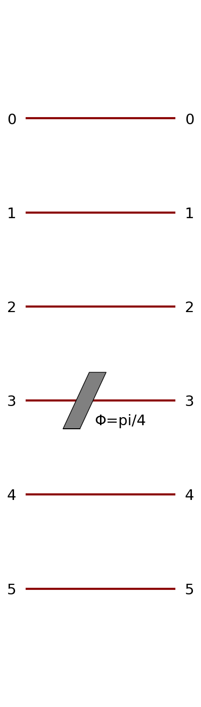
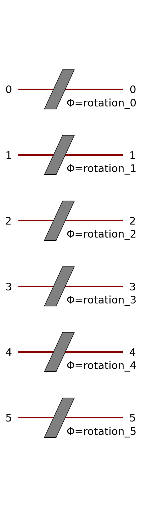
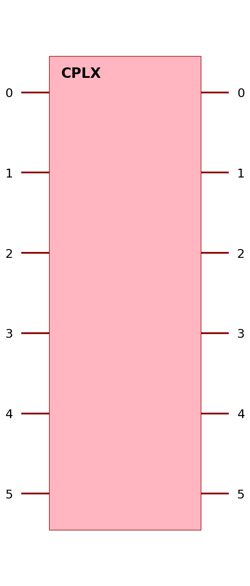
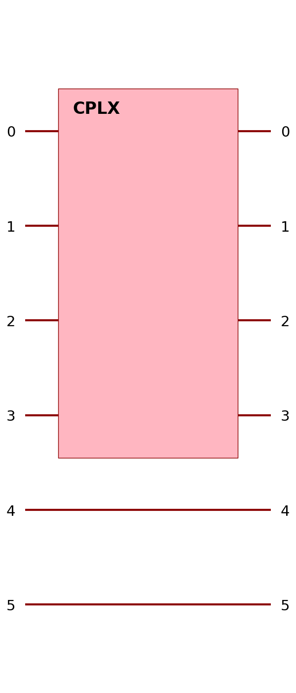
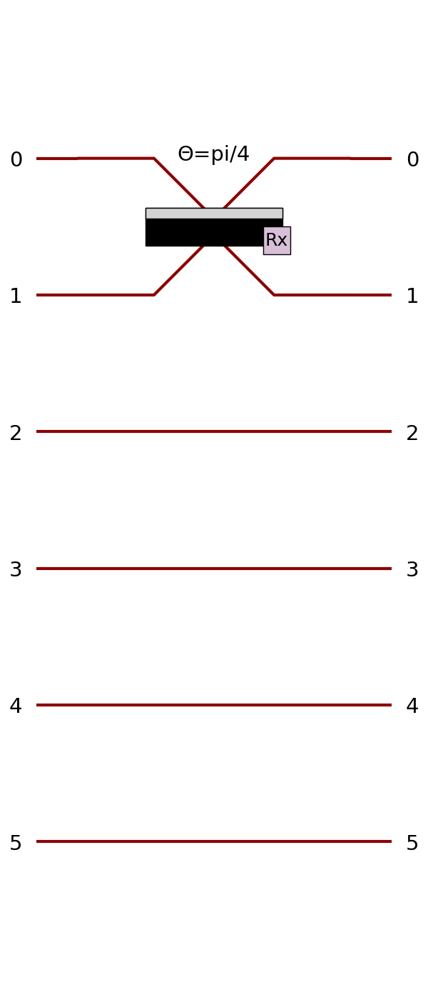

merlin.builder.circuit_builder module
=====================================

.. automodule:: merlin.builder.circuit_builder
   :members:
   :undoc-members:
   :show-inheritance:

--------------------------------------------------------------------------------
The different components of the builder with their arguments and example of code
--------------------------------------------------------------------------------

Below are the components available in the `CircuitBuilder` class:

1. **add_rotations**:
   - Adds one or multiple phase shifters across the specified modes.
   - Arguments:
     - `modes` (int | list[int] | ModuleGroup | None): Modes receiving the rotations. Defaults to all modes.
     - `axis` (str): Axis of rotation (default: "z").
     - `angle` (float): Fixed rotation angle for non-trainable cases.
     - `trainable` (bool): Promote the rotations to trainable parameters.
     - `name` (str): Optional stem used for generated parameter names.
     - `role` (:class:`~merlin.core.components.ParameterRole`): Explicitly set the parameter role.

.. code-block:: python
   builder = CircuitBuilder(n_modes=6)
   builder.add_rotations(modes=3, angle=np.pi / 4)

.. code-block:: python
   builder = CircuitBuilder(n_modes=6)
   builder.add_rotations(trainable=True, name="rotation")

2. **add_angle_encoding**:
   - Adds angle-based input encoding to the circuit.
   - Arguments:
     - `modes` (list[int]): Modes to target for encoding.
     - `name` (str): Prefix for generated input parameters.
     - `scale` (float): Scaling factor for angle mapping.

.. code-block:: python
   builder = CircuitBuilder(n_modes=6)
   builder.add_angle_encoding(modes=list(range(6)), name="input", scale=np.pi)

This will show as a rotation layer as data is encoded in phase shifters.

3. **add_entangling_layer**:
   - Adds an entangling layer spanning a range of modes (implemented with a generic interferometer).
   - Arguments:
     - `modes` (list[int]): Modes to span.
     - `trainable` (bool): Whether the entangling layer is trainable.
     - `model` (str): Choose `"mzi"` (default) or `"bell"` to select the interferometer template.
     - `name` (str): Optional prefix for parameter names.

.. code-block:: python
   builder = CircuitBuilder(n_modes=6)
   builder.add_entangling_layer(trainable=True, name="U1")

And to span it on different modes
.. code-block:: python
   builder = CircuitBuilder(n_modes=6)
   builder.add_entangling_layer(trainable=True, name="U1", modes = [0,3])

Switching to a Bell-style interferometer is as simple as:

.. code-block:: python
   builder.add_entangling_layer(model="bell", name="bell_block")

4. **add_superpositions**:
   - Adds one or more beam splitters with optional depth.
   - Arguments:
     - `targets` (tuple[int, int] | list[tuple[int, int]]): Explicit mode pairs receiving beam splitters. When omitted, nearest neighbours across ``modes`` (or all modes) are used.
     - `depth` (int): Number of successive passes to apply.
     - `theta` (float): Mixing angle for fixed beam splitters.
     - `phi` (float): Relative phase for fixed beam splitters.
     - `trainable` (bool): Convenience flag marking both parameters trainable.
     - `trainable_theta` (bool): Whether the mixing angle is trainable.
     - `trainable_phi` (bool): Whether the relative phase is trainable.
     - `modes` (list[int] or ModuleGroup): Mode span used when ``targets`` is omitted.
     - `name` (str): Optional prefix for generated parameter names.

.. code-block:: python
   builder = CircuitBuilder(n_modes=6)
   builder.add_superpositions(targets=(0, 1), trainable_theta=True, name="bs")

.. code-block:: python
   builder = CircuitBuilder(n_modes=6)
   builder.add_superpositions(depth=2, name="mix")

.. image:: ../../_static/img/builder_layer/entangling_layer_depth2.png
   :alt: A Entangling layer of depth 2
   :width: 200px
   :align: center

5. **build**:
    - Finalizes and returns the constructed circuit.
