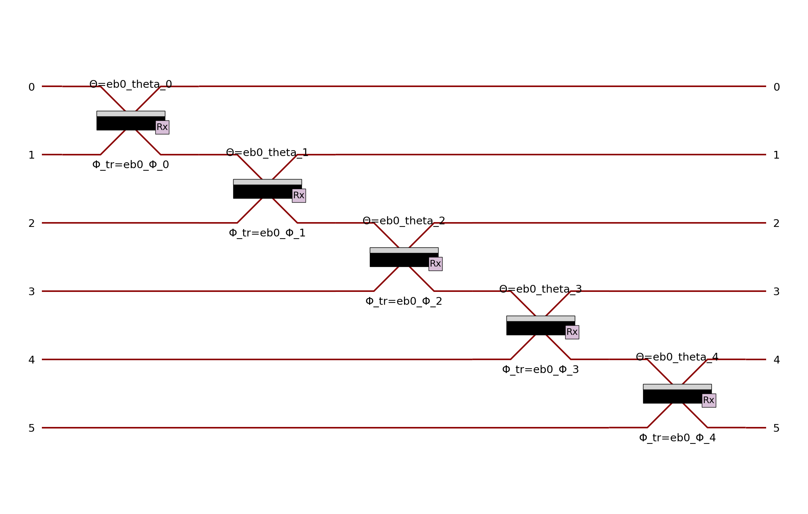
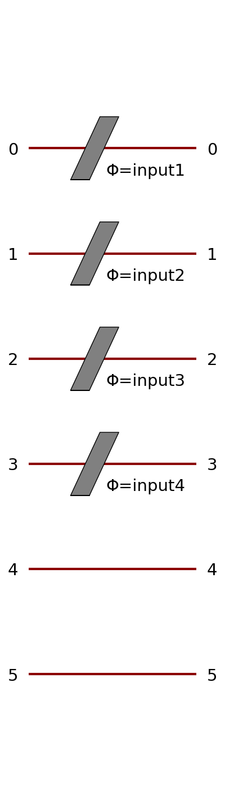
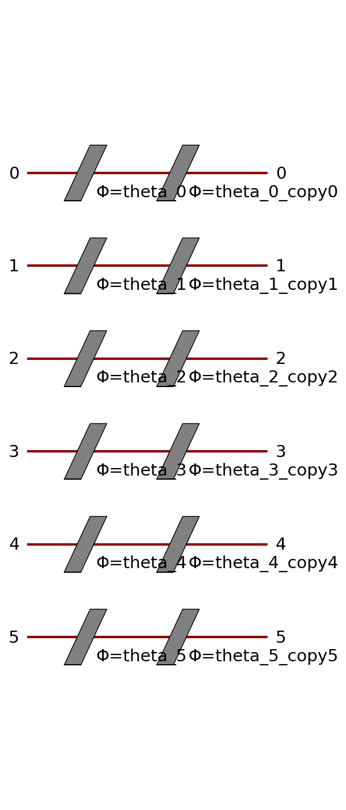

merlin.builder.circuit_builder module
=====================================

.. automodule:: merlin.builder.circuit_builder
   :members:
   :undoc-members:
   :show-inheritance:

--------------------------------------------------------------------------------
The different components of the builder with their arguments and example of code
--------------------------------------------------------------------------------

Below are the components available in the `CircuitBuilder` class:

1. **add_rotation**:
   - Adds a single rotation to the circuit.
   - Arguments:
     - `target` (int): Circuit mode index receiving the phase shifter.
     - `angle` (float): Initial numeric value for fixed rotations.
     - `trainable` (bool): Whether the rotation angle is trainable.
     - `name` (str): Optional custom name for the parameter.

.. code-block:: python
   builder = CircuitBuilder(n_modes=6)
   builder.add_rotation(target = 3, angle = np.pi/4)

.. image:: ../../_static/img/builder_layer/rotation_comp.png
   :alt: A Rotation component built with CircuitBuilder
   :width: 200px
   :align: center

2. **add_rotation_layer**:
   - Adds a layer of rotations across multiple modes.
   - Arguments:
     - `modes` (list[int] or ModuleGroup): Modes receiving the rotations.
     - `axis` (str): Axis of rotation (default: "z").
     - `trainable` (bool): Whether the rotations are trainable.
     - `name` (str): Optional custom name for the parameters.

.. code-block:: python
   builder = CircuitBuilder(n_modes=6)
   builder.add_rotation_layer(trainable = True, name = "rotation")

.. image:: ../../_static/img/builder_layer/rotation_layer.png
   :alt: A Rotation layer built with CircuitBuilder
   :width: 200px
   :align: center

3. **add_angle_encoding**:
   - Adds angle-based input encoding to the circuit.
   - Arguments:
     - `modes` (list[int]): Modes to target for encoding.
     - `name` (str): Prefix for generated input parameters.
     - `scale` (float): Scaling factor for angle mapping.

.. code-block:: python
   builder = CircuitBuilder(n_modes=6)
   builder.add_angle_encoding(modes=list(range(6)), name="input", scale=np.pi)

This will show as a rotation layer as data is encoded in phase shifters.

4. **add_generic_interferometer**:
   - Adds a generic interferometer spanning a range of modes.
   - Arguments:
     - `modes` (list[int]): Modes to span.
     - `trainable` (bool): Whether the interferometer is trainable.
     - `name` (str): Optional prefix for parameter names.

.. code-block:: python
   builder = CircuitBuilder(n_modes=6)
   builder.add_generic_interferometer(trainable=True, name="U1")

.. image:: ../../_static/img/builder_layer/generic.png
   :alt: A Generic Interferometer built with CircuitBuilder
   :width: 200px
   :align: center

And to span it on different modes
.. code-block:: python
   builder = CircuitBuilder(n_modes=6)
   builder.add_generic_interferometer(trainable=True, name="U1", modes = [0,3])

.. image:: ../../_static/img/builder_layer/generic_0_3.png
   :alt: A Generic Interferometer built with CircuitBuilder
   :width: 200px
   :align: center

5. **add_superposition**:
   - Adds a beam splitter (superposition component).
   - Arguments:
     - `targets` (tuple[int, int]): Pair of mode indices connected by the beam splitter.
     - `theta` (float): Mixing angle.
     - `phi` (float): Relative phase.
     - `trainable_theta` (bool): Whether the mixing angle is trainable.
     - `trainable_phi` (bool): Whether the relative phase is trainable.

.. code-block:: python
   builder = CircuitBuilder(n_modes=6)
   builder.add_superposition(targets = [0,1])

.. image:: ../../_static/img/builder_layer/supp_012.png
   :alt: A Superposition component (beam splitter)
   :width: 200px
   :align: center

6. **add_entangling_layer**:
   - Adds entangling layers to the circuit.
   - Arguments:
     - `depth` (int): Number of successive nearest-neighbour passes.
     - `trainable` (bool): Whether the beam splitters are trainable.
     - `name` (str): Optional prefix for parameter names.

.. code-block:: python
   builder = CircuitBuilder(n_modes=6)
   builder.add_entangling_layer(trainable = True)

.. code-block:: python
   builder = CircuitBuilder(n_modes=6)
   builder.add_entangling_layer(trainable = True, depth = 2)

.. image:: ../../_static/img/builder_layer/entangling_layer_depth2.png
   :alt: A Entangling layer of depth 1
   :width: 200px
   :align: center

7. **begin_section**:
   - Marks the beginning of a circuit section.
   - Arguments:
     - `name` (str): Name of the section.
     - `compute_adjoint` (bool): Whether to compute the adjoint of this section.
     - `reference` (str): Name of the section to copy structure from.
     - `share_trainable` (bool): Whether to share trainable parameters from the reference.
     - `share_input` (bool): Whether to share input parameters from the reference.

8. **end_section**:
   - Marks the end of the current circuit section.

.. code-block:: python
   builder = CircuitBuilder(n_modes=6)
   builder.begin_section(name="encoding", compute_adjoint=False)
   builder.add_angle_encoding(modes=list(range(X_train.shape[1])), name="input")
   builder.end_section()

9. **add_adjoint_section**:
   - Adds the adjoint of an existing section.
   - Arguments:
     - `name` (str): Name of the new adjoint section.
     - `reference` (str): Existing section to mirror.
     - `share_trainable` (bool): Whether to reuse trainable parameters.
     - `share_input` (bool): Whether to reuse input parameters.

.. code-block:: python
   builder = CircuitBuilder(n_modes=6)
   builder.begin_section(name="trainable", compute_adjoint=False)
   builder.add_rotation_layer(trainable=True, name="theta")
   builder.end_section()
   builder.add_adjoint_section(name="adjoint_trainable", reference="trainable", share_trainable=False, share_input=False)

10. **build**:
    - Finalizes and returns the constructed circuit.